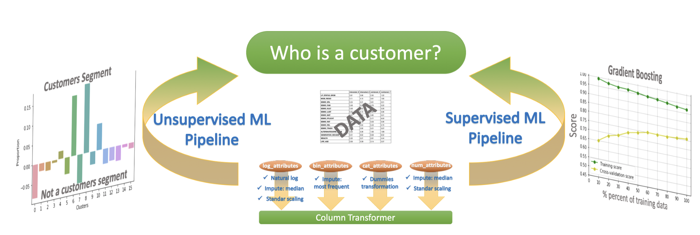

## Customer Segmentation Report for Arvato Financial Solutions

### Table of Contents

1. [Installation](#installation)
2. [Project Motivation](#motivation)
3. [File Descriptions](#files)
4. [Results](#results)
5. [Acknowledgements](#licensing)

## Installation 

There should be no necessary libraries to run the code here beyond the Anaconda distribution of Python.  I use Python version 3.7 to create the notebook with the following libraries Pandas, NumPy, Matplotlib, Scikit-Learn.One thing to note is that I use new version of scikit-learn to be able to use the new ColumnTransformer featrure. To install the newest Scikit-Learn run the following command:

conda install scikit-learn 

## Project Motivation

The goal of this work is to use unsupervised and supervised learning techniques to identify the customers for mail-order sales company. 

The project consists of three parts:
1. Customer Segmentation Report
Demographics data for customers of a mail-order sales company in Germany is compared against demographics information for the general population. PCA, Kmeans teqniques are used to perform customer segmentation, identifying the parts of the population that best describe the core customer base of the company.

2. Supervised Learning Model
Data set with attributes and responce from mail order campaign is used to build supervised machinelearning model that predicts whether or not each individual will respond to the campaign.

3. Kaggle Competition
The trained model is used to make predictions on the campaign data as part of a Kaggle Competition. Individuals are ranked by how likely they are to convert to being a customer for the company.

## File Descriptions 

1. Arvato_project_workbook.ipynb: notebook that showcases the analysis to all three steps of the project and includes the code for data cleaning, visualization.
2. data/: folder with .csv files with description of attributes in given data set
3. etl/etl.py: etl.py a python code supplementary functions for  extract transform load (etl) pipeline.
4. ml/unsupervised_ml.py: unsupervised_ml.py is a python code with supplementary functions for unsupervised learning pipeline.
5. ml/supervised_ml.py: supervised_ml.py is a python code with supplementary functions for supervised learning pipeline.

## Results

The main findings of the code can be found at the post available [here](https://medium.com/@elenaivanova_65377/customer-segmentation-report-for-arvato-financial-solutions-b08a01ac7bc0).

## Acknowledgements

Thanks Udacity, Figure Eight and Arvato for providing these apportunity to organize this project. 
